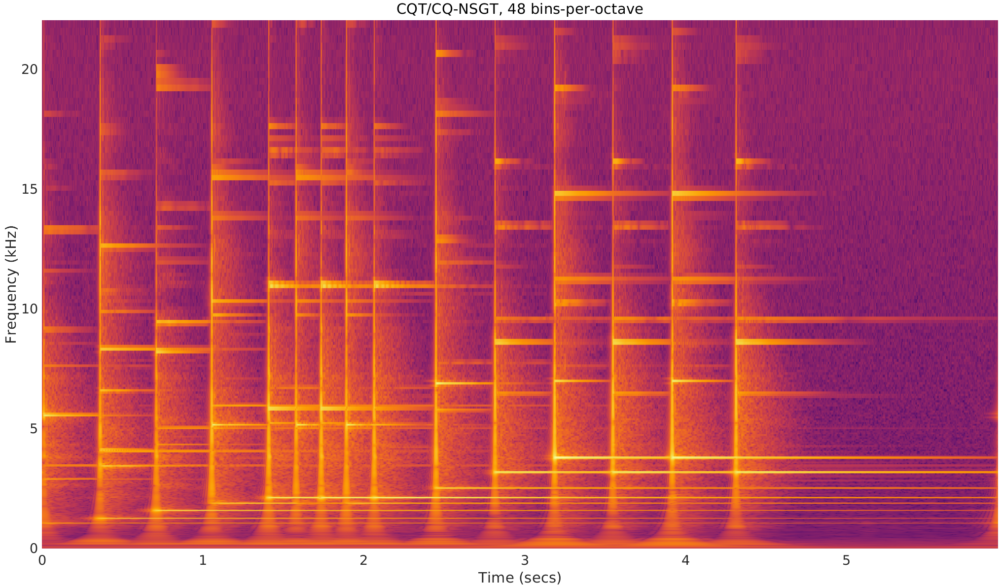
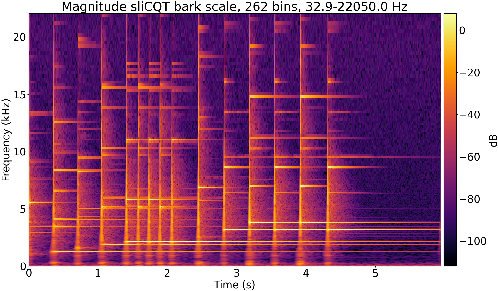

# Summary

Music source separation, or music demixing, is the task of decomposing or "demixing" a mixed recording of a song into its constituent sources, which are typically isolated instruments (e.g., drums, bass, vocals). The ISMIR 2021 Music Demixing Challenge^[<https://www.aicrowd.com/challenges/music-demixing-challenge-ismir-2021>] was created to stimulate new music demixing research. Open-Unmix [@umx], and the improved variant CrossNet-Open-Unmix [@xumx], are near-state-of-the-art deep learning models for music demixing which use the Short-Time Fourier Transform (STFT). Both were included in the challenge as baseline models.

From the time-frequency uncertainty principle [@gabor1946], the STFT of a signal cannot be maximally precise in both time and frequency, and the tradeoff of time-frequency resolution can significantly affect music demixing results [@tftradeoff1]. The proposed adaptation of Open-Unmix replaced the STFT with the sliCQT [@slicq], an alternative transform with varying time-frequency resolution designed for music analysis. The resulting model, xumx-sliCQ,^[<https://github.com/sevagh/xumx-sliCQ>] was 5x smaller and 2x slower than Open-Unmix, with competitive demixing results.

# Motivation

The STFT is computed by applying the discrete Fourier Transform on fixed-size windows of the input signal. From both auditory and musical motivations, variable-size windows are preferred, with long windows in the low frequency region to capture detailed harmonic information (i.e., a high frequency resolution), and short windows in the high frequency regions to capture transients with sharp temporal localization (i.e., a high time resolution) [@doerflerphd].

The sliCQ Transform [@slicq], or sliCQT, is a realtime implementation of the Nonstationary Gabor Transform [@balazs], a perfectly invertible time-frequency transform with complex Fourier coefficients computed with time-varying windows. An important application of the NSGT or sliCQT is to implement the Constant-Q Transform (CQT) for music [@jbrown; @klapuricqt], also called the CQ-NSGT (Constant-Q Nonstationary Gabor Transform).

\autoref{fig:spectrograms} shows a comparison of various spectrograms of a 5.94 second glockenspiel signal.^[<https://github.com/ltfat/ltfat/blob/master/signals/gspi.wav>] The spectrograms are generated using an STFT with the Open-Unmix default window size of 4096, the CQ-NSGT with 48 bins-per-octave, and the sliCQ Transform with 262 frequency bins in 32.9-22050 Hz on the Bark scale, which are the sliCQT parameters used in xumx-sliCQ.

{ width=48% }\hspace{0.5em}{ width=48% }
\vspace{-0.65em}

{ width=54% }

# Methodology

In music demixing, the oracle estimator represents the theoretical upper limit of performance of a given strategy using ground truth signals as perfect estimates. In Open-Unmix, the phase of the STFT is discarded, and the estimated magnitude STFT of the target is combined with the phase of the original mix to invert back to the time domain. This is sometimes referred to as the "noisy phase" [@noisyphase1; @noisyphase2]. The noisy phase oracle waveform for a single source is described by the equations in \autoref{eq:noisyphaseoracle}, where TFTransform and iTFTransform can represent the forward and backward STFT or sliCQT operations respectively.
\begin{equation}\label{eq:noisyphaseoracle}
\begin{split}
& X_{\text{mix}} = \text{TFTransform}(x_{\text{mix}}[n]), X_{\text{source}} = \text{TFTransform}(x_{\text{source}}[n])\\
& |X_{\text{mix}}| = \text{abs}(X_{\text{mix}}), \measuredangle{X_{\text{mix}}} = \text{angle}(X_{\text{mix}})\\
& |X_{\text{source}}| = \text{abs}(X_{\text{source}}), \measuredangle{X_{\text{source}}} = \text{angle}(X_{\text{source}})\\
& \hat{X}_{\text{source, noisy phase}} = |X_{\text{source}}| \cdot \measuredangle{X_{\text{mix}}}\\
& \hat{x}_{\text{source, noisy phase}}[n] = \text{iTFTransform}(\hat{X}_{\text{source, noisy phase}})
\end{split}
\end{equation}

The sliCQT parameters were chosen by maximizing the above "noisy-phase" oracle estimator in a random grid search. In practice, 60 iterations of a random search are enough to discover a high-performance set of parameters [@bengio]. The oracle was computed on the 14 validation tracks of MUDB18-HQ [@musdb18hq], where the STFT achieved a median SDR across all 4 targets of 6.23 dB, and the sliCQT with 262 frequency bins in 32.9-22050 Hz on the Bark scale achieved a median SDR of 7.42 dB.

# References
