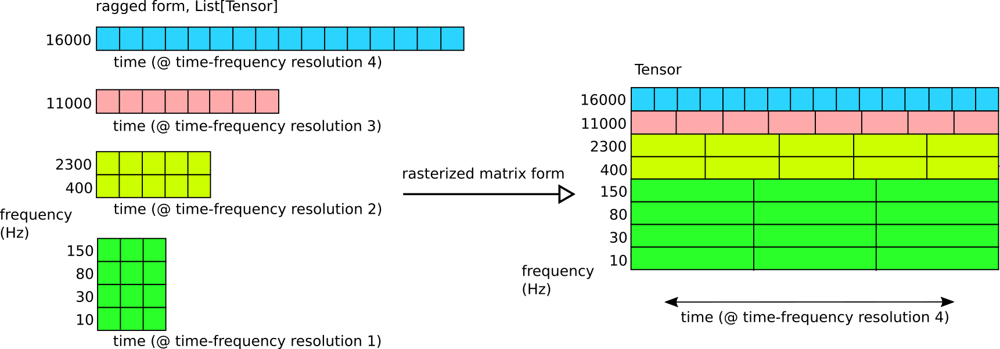
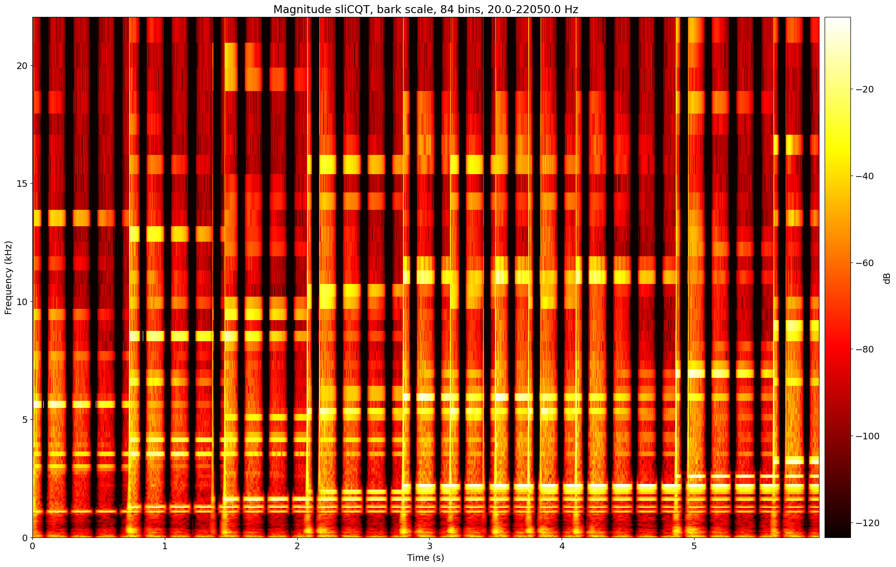
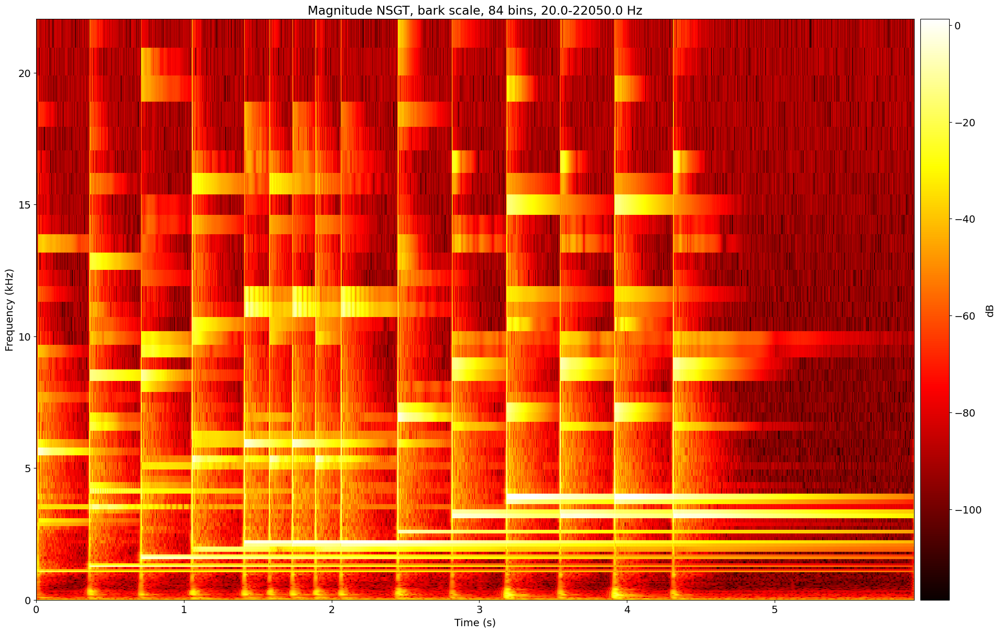
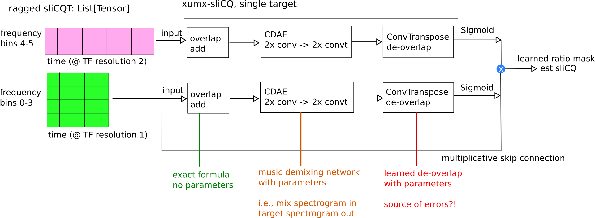
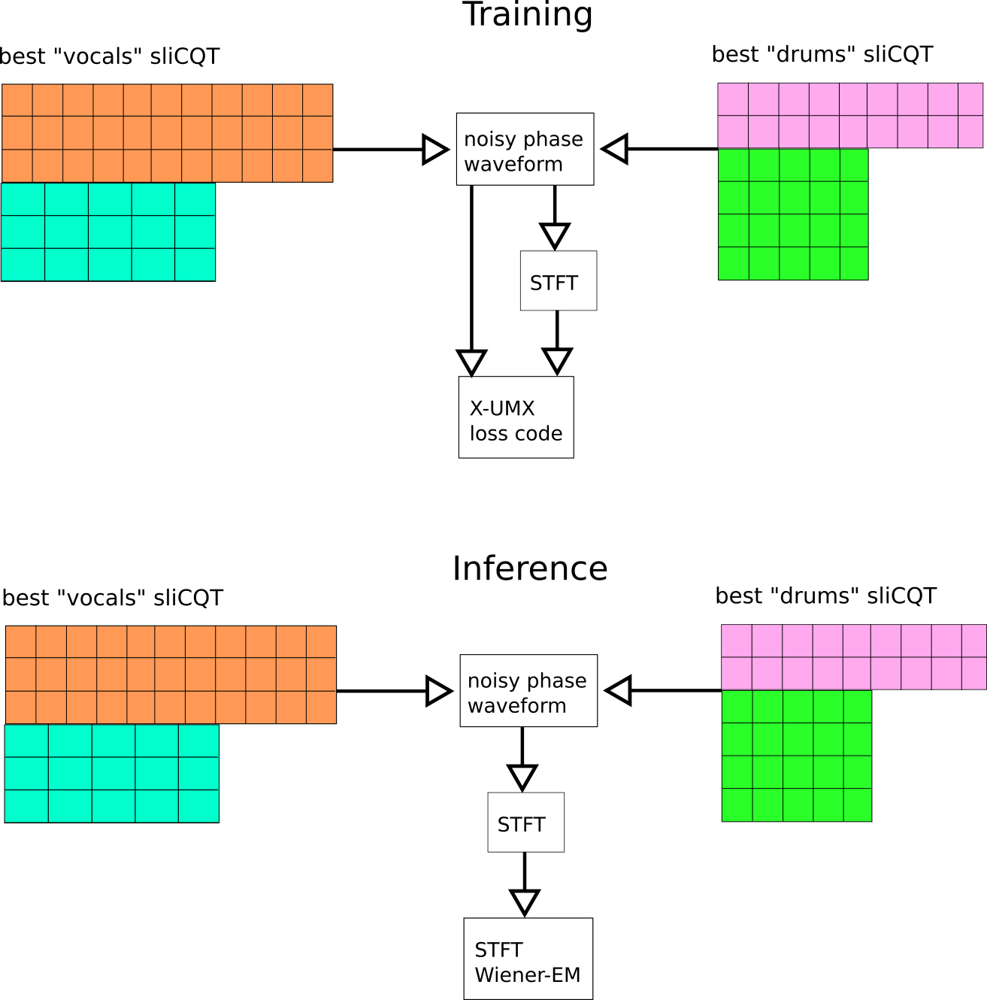

# sliceq22-ideas

A collection of ideas that might improve on my first attempt at [music demixing with the sliCQT](https://github.com/sevagh/xumx-sliCQ) submitted to [MDX 2021](https://mdx-workshop.github.io/)

### :rotating_light: Final update, 2022-01-16

I tried most of the below ideas while stuck indoors for a few weeks. None of them worked. After this, I no longer feel that working on xumx-sliCQ will be fruitful. Here's a list of the archived efforts of December 2021 and January 2022:
* [Standalone deoverlapnet](https://gitlab.com/sevagh/xumx_slicq_extra/-/tree/main/umx_experiments/slicqt-standalone-2022-improvements). Problems: specific deoverlapnet per sliCQT configs makes it a pain. I tried a "global" deoverlapnet with a stack of multi-resolution convolution layers, with terrible results. Couldn't breach ~21 dB reconstruction error, which is bad. This includes an interpolated matrix form using both the Torch [interpolate](https://pytorch.org/docs/1.9.1/generated/torch.nn.functional.interpolate.html) functions (forward and reverse), a learned deinterpolation network, and an exact repeated interpolation (like the diagram below).
* [xumx-sliCQ de-interpolate/deoverlapnet](https://gitlab.com/sevagh/xumx_slicq_extra/-/tree/main/umx_experiments/xumx-sliCQ-2022-interpolation), using the Torch interpolate and learned deoverlap/deinterpolation layers
* [xumx-sliCQ deoverlapnet](https://gitlab.com/sevagh/xumx_slicq_extra/-/tree/main/umx_experiments/xumx-sliCQ-2022-deoverlapnet), using a simple learned deoverlap layer without deinterpolation
* [xumx-sliCQ ConvNeXt](https://gitlab.com/sevagh/xumx_slicq_extra/-/tree/main/umx_experiments/xumx-sliCQ-2022-convnext), using the FAIR ConvNeXt architecture: [code](https://github.com/facebookresearch/ConvNeXt), [paper](https://arxiv.org/abs/2201.03545)
* [xumx-sliCQ repeated interpolation](https://gitlab.com/sevagh/xumx_slicq_extra/-/tree/main/umx_experiments/xumx-sliCQ-2022-repeated-interpolation), using a deoverlapnet and repeated interpolation/deinterpolation (exact formula, no errors)
* [xumx-sliCQ general 2022 update](https://gitlab.com/sevagh/xumx_slicq_extra/-/tree/main/umx_experiments/xumx-sliCQ-2022-general-gitlab-backup), a backup of miscellaneous 2022 attempts

My thoughts are that none of the below ideas were slam dunks in improving on the original 3.6 dB achieved by xumx-sliCQ. In most cases they took more memory due to the matrixform compared to the ragged form, and having the convolutional kernel slide across all frequency bins didn't seem to improve the demixing performance.

The standalone deoverlapnet did not significantly boost demixing results either, indicating the overlap/deoverlap was not really as big of a problem as I had assumed it to be.

All in all, it seems that trying random neural network architectures and hoping that they work is not a good strategy.

### Better 2014 sliCQT

In [xumx-sliCQ](https://github.com/sevagh/xumx-sliCQ), the sliCQT used is from the [Holighaus, Dörfler, Velasco, Grill, 2012](https://arxiv.org/abs/1210.0084) paper: "A framework for invertible, real-time constant-Q transforms." A characteristic of time-frequency transforms with varying time-frequency resolution (CQT, sliCQT, NSGT, etc.) is that the different frequency bins may have a different temporal framerate.

The next evolution of this transform is from the [Schörkhuber, Klapuri, Holighaus, Dörfler, 2014](https://www.researchgate.net/publication/274009051_A_Matlab_Toolbox_for_Efficient_Perfect_Reconstruction_Time-Frequency_Transforms_with_Log-Frequency_Resolution) paper: "A Matlab Toolbox for Efficient Perfect Reconstruction Time-Frequency Transforms with Log-Frequency Resolution." Essentia has implemented the better 2014 transform as the NSGConstantQ ([1](https://essentia.upf.edu/reference/std_NSGConstantQ.html), [2](https://mtg.github.io/essentia-labs/news/2019/02/07/invertible-constant-q/), [3](https://github.com/MTG/essentia/issues/136)). The paper claims two improvements over the 2012 version:
* More accurate phases in the transform: **can this improve the noisy-phase result of 7.42 dB?**
* Better matrix form with rasterization to upsample all temporal framerates to match the highest time resolution frequency bin

The following diagram shows an idealized illustration of the ragged and rasterized matrix forms:



The rasterized matrix form should be better in two ways:
* Better than zero-padding, by having meaningful time-frequency coefficients at all positions in the matrix; the reference implementation of the Holighaus 2012 transform [contains a matrix form with zero-padding](https://github.com/sevagh/nsgt#ragged-vs-matrix) that my networks couldn't learn from
* Simpler than the ragged transform: we only need to apply a neural network to a single matrix (more like the STFT)

### Learned de-overlap of adjacent slices

In the sliCQT, adjacent slices have a 50% overlap with one another and need to be overlap-added **(non-invertible!)** to create a meaningful spectrogram:

 

In xumx-sliCQ, the overlap-added magnitude sliCQ is used as the input to the CDAE, and a final transpose convolutional layer was added to created a learned de-overlap procedure as the last layer:



The new idea is to formulate and solve the problem of the de-overlap add separately from the music demixing network.

DeOverlapNet pseudocode:
```
x = get_waveform()                                   # any waveform, can even be fake/randomly generated

X = slicq(x)                                         # 3D sliceq: (frequency, slices, time_coef_per_slice)

X_flat = torch.flatten(X, start_dim=-2, end_dim=-1)  # 2D sliceq: (frequency, time_coef_total)
                                                     # time_coef_total = slices*time_coef_per_slice

X_meaningful = overlap_add(X_flat)                   # 2D sliceq: (frequency, time_coef_total//2)

X_flat_hat = DeOverlapNet(input=X_meaningful)        # 2D sliceq: (frequency, time_coef_total)

X_hat = X_flat_hat.reshape(X.shape)                  # 3D sliceq: (frequency, slices, time_coef_per_slice)

loss = MSE(X_hat, X)
```

Surely we can train this to a very low loss? Then, MDX network **without de-overlap layer**:

```
x, y = get_mix_and_target(target='vocals')           # single target x, y pair; x = mix, y = gt target

X = slicq(x)                                         # 3D sliceq: (frequency, slices, time_coef_per_slice)

X_flat = torch.flatten(X, start_dim=-2, end_dim=-1)  # 2D sliceq: (frequency, time_coef_total)
                                                     # time_coef_total = slices*time_coef_per_slice

X_meaningful = overlap_add(X_flat)                   # 2D sliceq: (frequency, time_coef_total//2)

Y_meaningful_hat = MDXNet(X_meaningful)              # spectrogram-to-spectrogram MDX network

Y_flat_hat = DeOverlapNet(Y_meaningful_hat)          # low error de-overlap, pre-trained!

Y_hat = Y_flat_hat.reshape(X.shape)                  # 2D slicq back to 3D

y_hat = islicq(Y_hat)                                # 3D slicq back to waveform

Y = slicq(y)

loss_freq_domain = MSE(Y_hat, Y)
loss_time_domain = SDR(y_hat, y)
```

### Different sliCQT parameters per target

Why do I use a single sliCQT?

* To use X-UMX cross-target loss functions, **sliCQT must be the same shape for all 4 targets!**
* However, for performance reasons, I do Wiener-EM with the STFT instead of sliCQT (+0.1 dB SDR, 2x slower)
* Idea: why not use the STFT for X-UMX loss functions?



### Picking best sliCQT: ridge analysis?

I asked on [DSP stackexchange](https://dsp.stackexchange.com/questions/78422/how-to-objectively-measure-how-good-a-time-frequency-representation-of-music-i) about how to objectively measure how "good" a time-frequency transform is. I was pointed to a concept called "ridge analysis": [view this paper on HAL](https://hal.archives-ouvertes.fr/hal-02945707/document).

Idea: use ridge analysis (or any of the above techniques) to find the best transform for a single target. Say, the best sliCQT for "drums" is one where the drum signal is most sparse. This may be _even more useful_ for future MDX, where targets are finer-grained (e.g. electric guitar, thanks [faroit](https://github.com/faroit)!)

### Misc

Improvements:
* Use regular SDR in X-UMX time-domain loss. From Rachel Bittner's keynote (MDX21/ISMIR 2021 Session B keynote), it seems that SI-SDR might not be ideal for music demixing applications; maybe using that as my loss function wasn't the best idea.
* Use Danna-Sep's idea of complex STFT in frequency-domain loss of X-UMX
