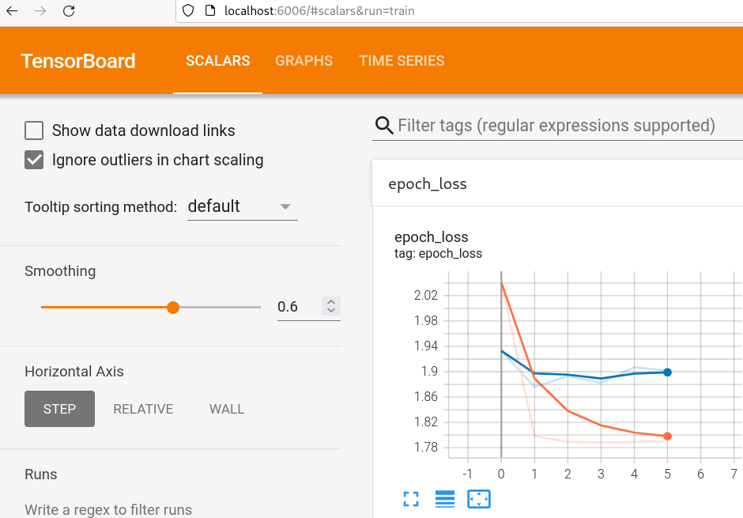

# sliceq22-ideas

A collection of ideas that might improve on my first attempt at [music demixing with the sliCQT](https://github.com/sevagh/xumx-sliCQ) (which was submitted to [MDX 2021](https://mdx-workshop.github.io/)):

* The name is from "sliceq" (the sliCQT/sliced Constant-Q transform), and 22 for "MDX 2022" in anticipation of next year's challenge
* :warning: I won't be able to work on this in the near future so I'm creating this as more of an idea dump than working code
* :no_entry: It needs a lot of work! So don't take this document too seriously, and feel free to open any GitHub issues

### Better 2014 sliCQT

In [xumx-sliCQ](https://github.com/sevagh/xumx-sliCQ), the sliCQT used is from the [Holighaus, Dörfler, Velasco, Grill, 2012](https://arxiv.org/abs/1210.0084) paper: "A framework for invertible, real-time constant-Q transforms." A characteristic of time-frequency transforms with varying time-frequency resolution (CQT, sliCQT, NSGT, etc.) is that the different frequency bins may have a different temporal framerate. The reference implementation of the Holighaus 2012 transform [contains a matrix form with zero-padding](https://github.com/sevagh/nsgt#ragged-vs-matrix), but my networks couldn't learn from it.

The next evolution of this transform is from the [Schörkhuber, Klapuri, Holighaus, Dörfler, 2014](https://www.researchgate.net/publication/274009051_A_Matlab_Toolbox_for_Efficient_Perfect_Reconstruction_Time-Frequency_Transforms_with_Log-Frequency_Resolution) paper: "A Matlab Toolbox for Efficient Perfect Reconstruction Time-Frequency Transforms with Log-Frequency Resolution." Essentia has implemented the better 2014 transform as the NSGConstantQ ([1](https://essentia.upf.edu/reference/std_NSGConstantQ.html), [2](https://mtg.github.io/essentia-labs/news/2019/02/07/invertible-constant-q/), [3](https://github.com/MTG/essentia/issues/136)). The paper claims two improvements over the 2012 version:
* More accurate phases in the transform
* Better matrix form with rasterization to upsample all temporal framerates to match the highest time resolution frequency bin

The following diagram shows an idealized illustration of the ragged and rasterized matrix forms:


A single matrix as an input to a neural network should be easier to manage than a ragged list of tensors, and hopefully more successful network architectures can be found.

### Learned de-overlap of adjacent slices

In the sliCQT, adjacent slices have a 50% overlap with one another and need to be overlap-added to create a meaningful spectrogram:

 

In xumx-sliCQ, the overlap-added magnitude sliCQ is used as the input, and a transpose convolutional layer was used to created a learned de-overlap procedure as the last layer of the neural network. The new idea is to formulate and solve the problem of the de-overlap add separately from a music demixing network. The overlap and de-overlap procedures are lower level than the final musical application.

The hope is that if the de-overlap can be solved with a low reconstruction error, then a music demixing system can be trained to only use the overlap-added sliCQT spectrograms as inputs and outputs, and the separate de-overlap pre-trained model can be used to go back to the time-domain waveform.

The overlap and de-overlap look like this:
```
from sliceq22.overlap import nsgcq_overlap_add

x, fs = load_audio(audio_file)         # load audio

cq_frames = nsgconstantq(x)

cq_frames = (32, 303, 108)             # 303 frequency bins, 32 slices, 108 time coefficients each
cq_flat = (303, 3456)                  # 32*108 = 3456 flattened frequency bins

cq_ola = nsgcq_overlap_add(cq_frames)  # non-invertible 50% overlap-add for adjacent slices
                                       # the cq is hopped through in steps of 108, the temporal width of each slice
cq_ola = (303, 1728)                   # output

deoverlapnet = Sliceq22Model()         # the trained or pre-trained model

cq_deoverlap = deoverlapnet(cq_ola)    # some magical architecture that can easily solve the problem
cq_deoverlap = (32, 303, 108)          # de-overlapped, back to full slicq

x_recon = insgconstantq(cq_deoverlap)  # the reconstruction, measure its dB here
```

Problems with the learned de-overlap network as it stands now are:

* Mono instead of stereo NSGConstantQ, although a MUSDB18-HQ-based demixing system would require a stereo transform
* It uses the MUSDB18-HQ dataset just for convenience, although any audio/music dataset can (or should) be used
* Poor/unpromising network performance, with an MSE of 1.8
* No measurement of dB reconstruction error (since the MSE performance is so bad, there's no point)
* The network architecture and size of the convolutional layers depend on the NSGConstantQ parameters, defined in `nsg_params.json`:
  ```
  {
    "frameSize": 8192,
    "transitionSize": 1024,
    "minFrequency": 65.41,
    "maxFrequency": 6000,
    "binsPerOctave": 48
  }
  ```
  An entire new network needs to be defined and trained for a different parameter NSGConstantQ
* Do we really need thousands of  parameters to learn a de-overlap of 108 coefficients?

### sliCQT parameter search

#### Noisy-phase or mix-phase oracle

In xumx-sliCQ, the parameter search used the noisy-phase or mix-phase inversion (MPI) oracle (mix phase + amplitude/magnitude of target). The SDR of the MPI was maximized in a 60-iteration grid search to find the best sliCQ parameters.

The same MPI parameter search may produce different or better results when repeated with the new 2014 sliCQT:
* Recompute the MPI taking into account the improved phase and rasterized matrix form
* Recompute the MPI with the learned de-overlap network

The Essentia NSGConstantQ is only implemented for the log scale (i.e. Constant-Q) and Variable-Q (same with a small offset). The sliCQT library used supports the mel and Bark psychoacoustic scales in addition to those 2. To do a full parameter search with the same 4 frequency scales would require the psychoacoustic scales to be added to Essentia (but perhaps they're not even necessary for optimal music demixing).

#### Different sliCQT parameters per target

The parameter search for xumx-sliCQ considered the median SDR across all 4 targets, or maximize the performance of each target in a separate parameter search.

The different sliCQT parameters per target idea was abandoned in xumx-sliCQ to be able to use the combination loss of xumx (wherein the 4 target sliCQTs are summed in the various loss functions - and to be summed, they need to be the same shape by using the same parameters). However, as a counterpoint, the Wiener-EM step can be done in both the sliCQT and the STFT domain ([1](https://github.com/sevagh/xumx-sliCQ/blob/main/docs/wiener_em.md), [2](https://github.com/sevagh/xumx-sliCQ#network-architecture)). This actually means that the combination loss of xumx might be usable in conjunction with different sliCQTs per-target, _if_ the xumx loss is done in the STFT domain as well.

#### Ridge analysis

I asked on [DSP stackexchange](https://dsp.stackexchange.com/questions/78422/how-to-objectively-measure-how-good-a-time-frequency-representation-of-music-i) about how to objectively measure how "good" a time-frequency transform is. I was pointed to a concept called "ridge analysis": [view this paper on HAL](https://hal.archives-ouvertes.fr/hal-02945707/document).

The whole point of using the sliCQT with the varying time-frequency resolution was to represent the transient and tonal components of music with good definition within a single transform. The idea is to objectively compute the best parameters of the sliCQT by which one is representing tonal/transient the best.

It seems complicated, but the (hazy) idea in my head can look like:
1. Use ridge analysis (or any of the above techniques) to find the best transform for a single target. Say, the best sliCQT for "drums" is one where the drum signal is most sparse
2. Or, use ridge analysis to find the best transform where a single target is much better than the others. E.g., imagine a good sliCQT for bass is also good for vocals, but there's a different sliCQT where bass isn't as good, but vocals are even worse, resulting in a better separation

### More data

During my participation in MDX 21, I [discussed](https://discourse.aicrowd.com/t/making-new-music-available-for-demixing-research/6344) and then [created](https://github.com/OnAir-Music/OnAir-Music-Dataset) the OnAir Music Dataset.

To align with MUSDB18-HQ, the dataset can benefit from a data loader for the classic 4 targets (drums, bass, vocals, other). The raw stems will always be provided as-is from the artists and recording/mixing engineer of the OnAir Music project. The data loader will be the component that transforms the raw stems into the 4 targets.

### Install and run the code

Clone this repo with submodules

```
$ git clone --recurse-submodules https://github.com/sevagh/sliceq22
```

Alternatively, clone it regularly and fetch the submodules:

```
$ git clone https://github.com/sevagh/sliceq22
$ cd sliceq22
$ git submodule update --init --recursive
```

Set up and activate a virtualenv

```
$ virtualenv --python=python3.9 ~/venvs/sliceq22
$ source ~/venvs/sliceq22/bin/activate
(sliceq22) $ 
```

Install the requirements.txt file

```
(sliceq22) $ pip install -r ./requirements.txt
```

Configure, compile, and install Essentia from the locally vendored git submodule

```
(sliceq22) $ cd essentia
(sliceq22) $ python ./waf configure --build-static --with-python
(sliceq22) $ python ./waf
(sliceq22) $ python ./waf install
```

Train the model:
```
(sliceq22) $ ./train.py --musdbhq-root ~/MUSDB18-HQ/
...
Epoch 00001: val_loss improved from inf to 1.93293, saving model to ./sliceq22-train/sliceq2_20211010-131618.ckpt
Epoch 2/1000
75/75 [==============================] - 29s 384ms/step - loss: 1.7981 - mse: 1.7981 - val_loss: 1.8761 - val_mse: 1.8761

Epoch 00002: val_loss improved from 1.93293 to 1.87605, saving model to ./sliceq22-train/sliceq2_20211010-131618.ckpt
Epoch 3/1000
75/75 [==============================] - 29s 383ms/step - loss: 1.7895 - mse: 1.7895 - val_loss: 1.8933 - val_mse: 1.8933

Epoch 00003: val_loss did not improve from 1.87605
Epoch 4/1000
75/75 [==============================] - 29s 383ms/step - loss: 1.7883 - mse: 1.7883 - val_loss: 1.8824 - val_mse: 1.8824
```

Run inference to view a spectrogram:
```
$ ./train.py --musdbhq-root ~/MUSDB18-HQ \
                --model-file ./sliceq22-train/sliceq2_20211010-081701.h5 \
                --inference-file ./gspi.wav
...
Reconstruction SNR of sliCQ-isliCQ (no overlap): 12.034 dB
2021-10-10 13:44:44.182756: I tensorflow/compiler/mlir/mlir_graph_optimization_pass.cc:185] None of the MLIR Optimization Passes are enabled (registered 2)
X: (1, 313, 1728, 1), Y_gt: (1, 108, 313, 32, 1), Y_pred: (1, 108, 313, 32, 1)
x: (313, 1728), y_gt: (313, 1728), y_pred: (313, 1728)
/home/sevagh/repos/sliceq22-ideas/sliceq22/audio.py:40: RuntimeWarning: divide by zero encountered in log10
  axs[0].matshow(np.log10(np.abs(x)), origin='lower', aspect='auto')
/home/sevagh/repos/sliceq22-ideas/sliceq22/audio.py:43: RuntimeWarning: divide by zero encountered in log10
  axs[1].matshow(np.log10(np.abs(y_gt)), origin='lower', aspect='auto')
```

### De-overlap network details

The network architecture is based on convolutional layers, but with a low performance (better architectures are needed):

```
Model: "sliceq22_model"
_________________________________________________________________
Layer (type)                 Output Shape              Param #
=================================================================
input_1 (InputLayer)         [(None, 313, 1728, 1)]    0
_________________________________________________________________
conv2d_transpose (Conv2DTran (None, 313, 5289, 32)     3488
_________________________________________________________________
batch_normalization (BatchNo (None, 313, 5289, 32)     128
_________________________________________________________________
conv2d (Conv2D)              (None, 313, 5182, 24)     82968
_________________________________________________________________
batch_normalization_1 (Batch (None, 313, 5182, 24)     96
_________________________________________________________________
conv2d_1 (Conv2D)            (None, 313, 5182, 1)      25
_________________________________________________________________
cropping2d (Cropping2D)      (None, 313, 3456, 1)      0
_________________________________________________________________
reshape (Reshape)            (None, 108, 313, 32, 1)   0
=================================================================
Total params: 86,705
Trainable params: 86,593
Non-trainable params: 112
```

It uses the Adam optimizer with 1000 epochs, an early stopping patience of 500, and MSE of the magnitude sliCQT as the loss function. TensorBoard is suggested to monitor the training:


