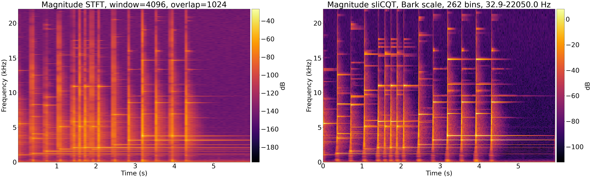
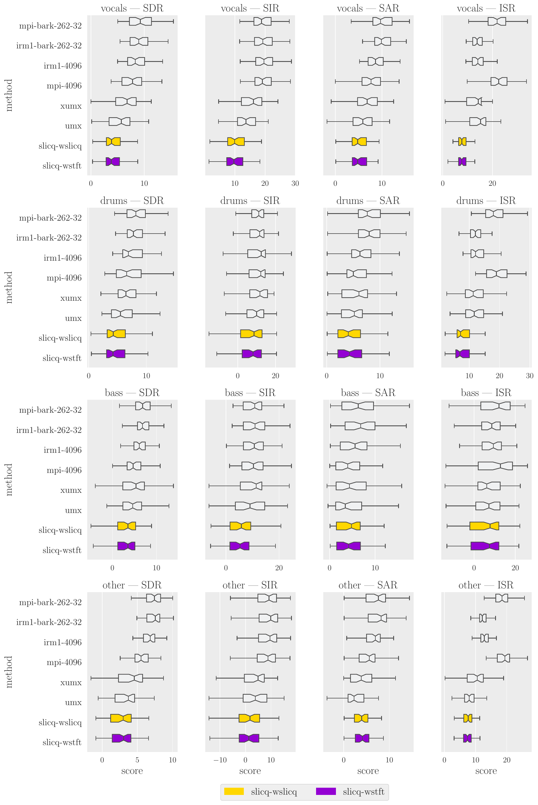
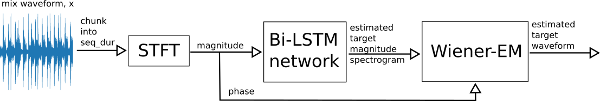
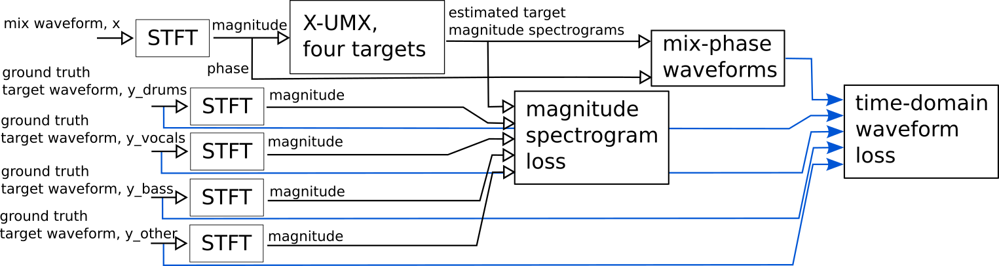
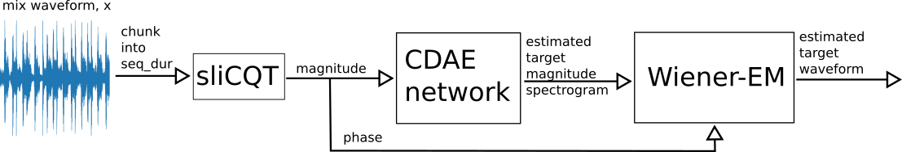
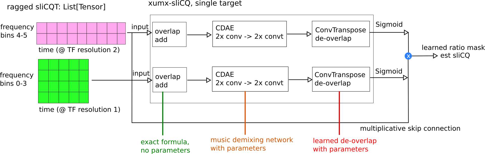
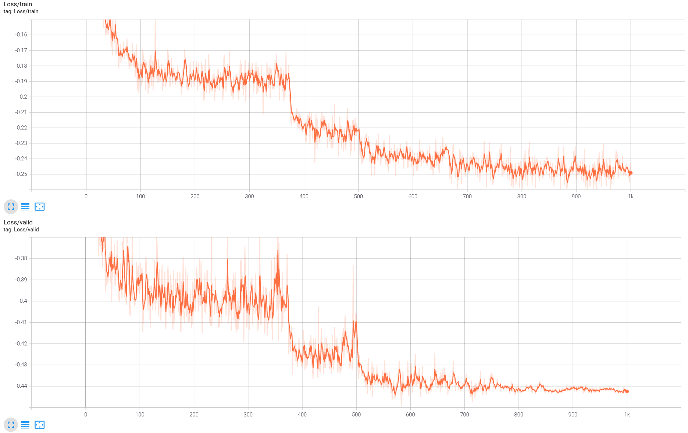

# xumx-sliCQ; music demixing with the sliCQ transform

xumx-sliCQ is a variant of the [UMX](https://github.com/sigsep/open-unmix-pytorch) and [X-UMX](https://github.com/sony/ai-research-code/tree/master/x-umx) music demixing networks, which uses the sliCQT to address the time-frequency tradeoff in the STFT.

The 2022 version of xumx-sliCQ achieves :heavy_check_mark: :rocket: **6.85 dB** :rocket: :heavy_check_mark: on MUSDB18-HQ after incorporating several of my [ideas for improvement](https://gitlab.com/sevagh/xumx_slicq_extra/-/tree/main/sliceq22-ideas). It outperforms both UMX (4.6 dB) and X-UMX (5.54 dB) with a smaller network (50MB vs. 137MB), at the cost of more expensive training and inference.

## Publications & citations

Papers called **"Better music demixing with the sliCQ transform"** use the newer [v2022 code](https://github.com/sevagh/xumx-sliCQ/tree/v2022) which scores :rocket: 6.85 dB :rocket::

Papers called **"Music demixing with the sliCQ transform"** use the older [v2021 code](https://github.com/sevagh/xumx-sliCQ/tree/v2021) which scores :warning: 3.6 dB :warning::
* Master's thesis for M.A. Music Technology at McGill University (link TBA)
* [MDX21 workshop](https://mdx-workshop.github.io/) @ ISMIR 2021, [pdf](https://mdx-workshop.github.io/proceedings/hanssian.pdf), followup of the [Music Demixing Challenge](https://www.aicrowd.com/challenges/music-demixing-challenge-ismir-2021)
* [arXiv](https://arxiv.org/abs/2112.05509) and [MML21](https://sites.google.com/view/mml-2021/home)

## Motivation

The sliCQT transform, which is a realtime implementation of the Nonstationary Gabor Transform (NSGT), is a spectral transform that allows for arbitrary nonlinear frequency scales with perfect inversion. It can be used to create spectrograms that vary their time-frequency resolution for both auditory and musical considerations.



## Results

BSS (blind source separation) scores, originating from [Vincent et al. 2006](https://hal.inria.fr/inria-00544230/document), are a popular objective measure of source separation performance. BSS is used in much of source separation and demixing literature, and [BSSv4](https://github.com/sigsep/sigsep-mus-eval#bsseval-v4) was used in the [SiSec 2018 evaluation campaign](https://arxiv.org/abs/1804.06267).

The evaluation code (using mostly [SigSep tools](https://github.com/sigsep/)) is stored in the [xumx_slicq_extra](https://gitlab.com/sevagh/xumx_slicq_extra/-/tree/main/mss_evaluation) repo, and the compared systems are:

| Project | Name in boxplot | Paper | Repo | Pretrained model |
|--------------|--------|-------|------|------------------|
| Open-Unmix (UMX) | `umx` | [Stöter, Uhlich, Liutkus, Mitsufuji 2019](https://hal.inria.fr/hal-02293689/document) | https://github.com/sigsep/open-unmix-pytorch | https://zenodo.org/record/3370489 (UMX-HQ) |
| CrossNet-OpenUnmix (X-UMX) | `xumx` |  | https://github.com/sony/ai-research-code/tree/master/x-umx | https://nnabla.org/pretrained-models/ai-research-code/x-umx/x-umx.h5 |
| xumx-sliCQ | `slicq` | n/a | https://github.com/sevagh/xumx-sliCQ | https://github.com/sevagh/xumx-sliCQ/tree/main/pretrained-model |

The following boxplot (generated like [SiSec 2018](https://github.com/sigsep/sigsep-mus-2018-analysis)) shows the BSSv4 scores of UMXHQ vs. X-UMX vs. xumx-sliCQ (both configurations of Wiener EM) on the 50-track MUSDB18-HQ test set, alongside two oracles (IRM1 and MPI or mixed-phase oracle):



## Network architecture

The following block diagrams show the evolution of xumx-sliCQ from UMX and X-UMX.

UMX:



X-UMX:



xumx-sliCQ, single target:



The ragged sliCQ is stored in a matrix with zero-padding to support the Wiener EM step directly on the sliCQ transform ([adapting STFT Wiener EM to the sliCQ is discussed here](https://discourse.aicrowd.com/t/umx-iterative-wiener-expectation-maximization-for-non-stft-time-frequency-transforms/6191)). However, the execution time is slower (and native sliCQ Wiener-EM times out in the competition). Therefore, it's controlled by the flag `--slicq-wiener` in the evaluate script. See [docs/wiener_em.md](./docs/wiener_em.md) for more details.

A look into each of the 4 target networks of xumx-sliCQ shows how the convolutional network architecture is applied to the ragged sliCQ transform, where each block contains the frequency bins that share the same time-frequency resolution:



**N.B.** only two blocks are shown for illustrative purposes in the diagram, but the sliCQ used in the model has 262 frequency bins grouped into 70 time-frequency resolution blocks.

Each "Conv-Net" shown above is loosely based on the 2-layer convolutional denoising autoencoder architecture that can be seen in [Grais, Zhao, and Plumbley 2019](https://arxiv.org/abs/1910.09266). The encoder consists of 2x `Conv2d -> BatchNorm2d -> ReLU`, and the decoder consists of 2x `ConvTranspose2d -> BatchNorm2d -> ReLU`. The LSTM model of Open-Unmix did not produce good results in my experiments, and I had better luck with convolutional models.

The same kernel is used in both layers. The time and filter kernel sizes are chosen based on the number of frequency bins and time coefficients inside each block. Dilations are used in the time axis to increase the receptive field while keeping inference time low.

| Frequency bins per block | Frequency kernel size |
|----------------|------------------|
| nb_f < 10 | 1 |
| 10 <= nb_f < 20 | 3 |
| nb_f >= 20 | 5 |

| Time coefficients per block | Time kernel size |
|-----------------------------|------------------|
| nb_t <= 100 | 7, dilation=2 |
| nb_t > 100 | 13, dilation=2 |

The total number of learnable parameters is ~6.7 million:
```
===============================================================================================
Total params: 6,669,912
Trainable params: 6,669,912
Non-trainable params: 0
Total mult-adds (G): 194.27
===============================================================================================
Input size (MB): 28.63
Forward/backward pass size (MB): 9359.33
Params size (MB): 26.68
Estimated Total Size (MB): 9414.64
```

### sliCQ parameter search

The parameters of the sliCQ were chosen by a 60-iteration random parameter search using the "mix-phase oracle", where the ground truth magnitude sliCQ is combined with the mix phase to get a complex sliCQ. The result is inverted to the time domain to get the SDR of the waveform. 60 iterations are enough to give a statistically good combination of parameters in a large problem space according to [Bergstra and Bengio 2012](https://www.jmlr.org/papers/volume13/bergstra12a/bergstra12a.pdf). The parameter search is described in more detail in [docs/slicq_params.md](./docs/slicq_params.md).

The configuration chosen for the xumx-sliCQ network uses the Bark scale with 262 bins, 32.9 - 22050 Hz, and slice and transition lengths of 18060 and 4516 samples (409 ms and 102 ms respectively). For a detailed look at the shape and nature of the sliCQ transform, as well as its noninvertible 50% overlap, look at [docs/slicq_shape.md](./docs/slicq_shape.md).

## Training and inference

The provided [conda yml file](./scripts/environment-gpu-linux-cuda11.yml) should install all the dependencies needed to train and run inference on xumx-sliCQ (using Python 3.9 with the Fedora 34 amd64 OS):

```
sevagh:xumx-sliCQ $ conda env create -f ./scripts/environment-gpu-linux-cuda11.yml
sevagh:xumx-sliCQ $ conda activate xumx-slicq-gpu
(xumx-slicq-gpu) sevagh:xumx-sliCQ $
```

xumx-sliCQ trains for 1000 epochs, like XUMX, with no early stopping patience. The best loss was -0.449, achieved at epoch 583. The [training script](./scripts/train.py) launches a tensorboard process in the background for training monitoring purposes:



The loss applies a mixing coefficient of 0.1 to the time domain SISDR loss, to bring it to a similar order of magnitude of the MSE loss of the sliCQ transform:

```
loss = 0.1*sisdr_loss + mse_loss
```

An epoch takes roughly 5.8 minutes to execute on an RTX 3080 Ti with batch_size=32 and nb_workers=4 (Ryzen 3700x). The same training ideas are used from [open-unmix](https://github.com/sigsep/open-unmix-pytorch/blob/master/docs/training.md):
* chunking with a seq_dur of 1s (the umx default of 6s makes the training prohibitively slow with 15+ minute epochs - on the other hand, >1s durations would have allowed for larger convolution kernels in the time direction)
* random track mixing (same as UMX)
* balanced track sampling (same as UMX)
* gain and channelswap augmentations (same as UMX)

If your GPU has less than 12GB device memory, you probably need to adjust the batch_size downwards to 16 or 8.


The pretrained model is [included in this repository](./pretrained-model). The weights are 28MB on disk (Linux), considerably smaller than umxhq (137MB) and x-umx (136MB). The [training script](./scripts/train.py) defines default arguments which are the same as the arguments used to train the [pretrained model](./pretrained-model) of xumx-sliCQ. As such, to reproduce my results, you need to simply run it (adjusting `--nb-workers` depending on your CPU - 4 is a reasonable value I borrowed from Open-Unmix):

```
$ python scripts/train.py --root=/path/to/musdb18hq --nb-workers=4 --output=/train/dir/
```
